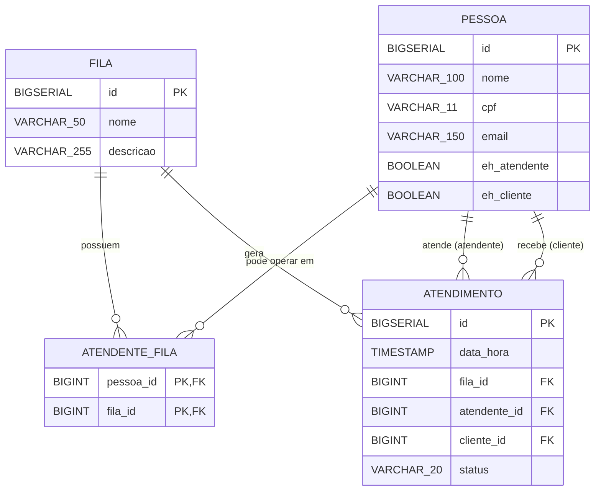

```mermaid
erDiagram
    PESSOA {
        BIGSERIAL id PK
        VARCHAR_100 nome
        VARCHAR_11 cpf
        VARCHAR_150 email
        BOOLEAN eh_atendente
        BOOLEAN eh_cliente
    }

    FILA {
        BIGSERIAL id PK
        VARCHAR_50 nome
        VARCHAR_255 descricao
    }

    ATENDENTE_FILA {
        BIGINT pessoa_id PK, FK
        BIGINT fila_id PK, FK
    }

    ATENDIMENTO {
        BIGSERIAL id PK
        TIMESTAMP data_hora
        BIGINT fila_id FK
        BIGINT atendente_id FK
        BIGINT cliente_id FK
        VARCHAR_20 status
    }

    PESSOA ||--o{ ATENDENTE_FILA : "pode operar em"
    FILA ||--o{ ATENDENTE_FILA : "possuem"
    FILA ||--o{ ATENDIMENTO : "gera"
    PESSOA ||--o{ ATENDIMENTO : "atende (atendente)"
    PESSOA ||--o{ ATENDIMENTO : "recebe (cliente)"
```
